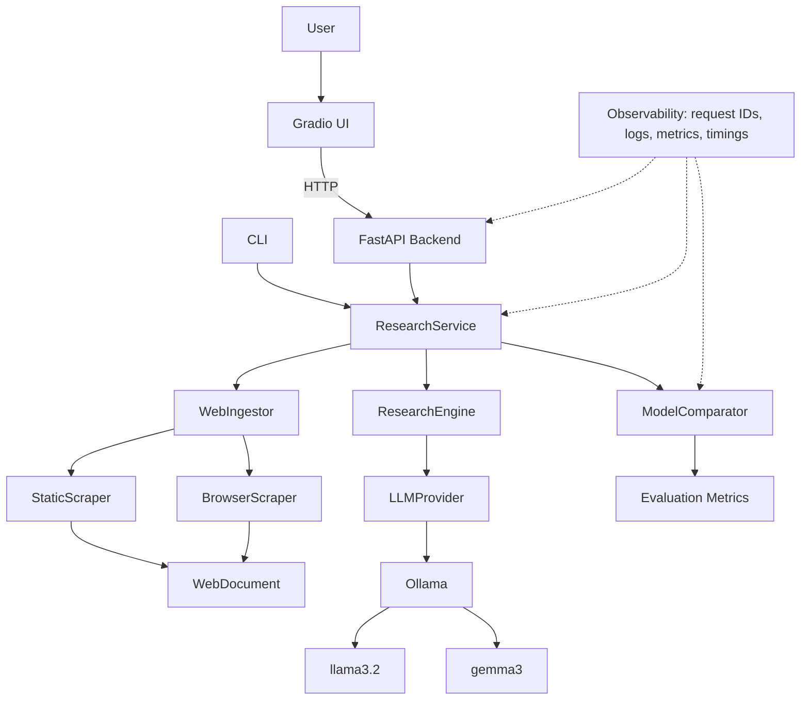
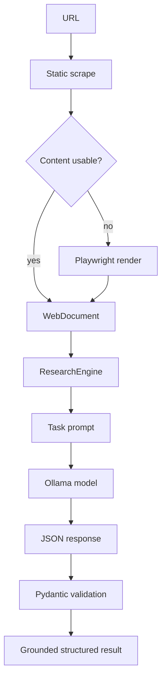
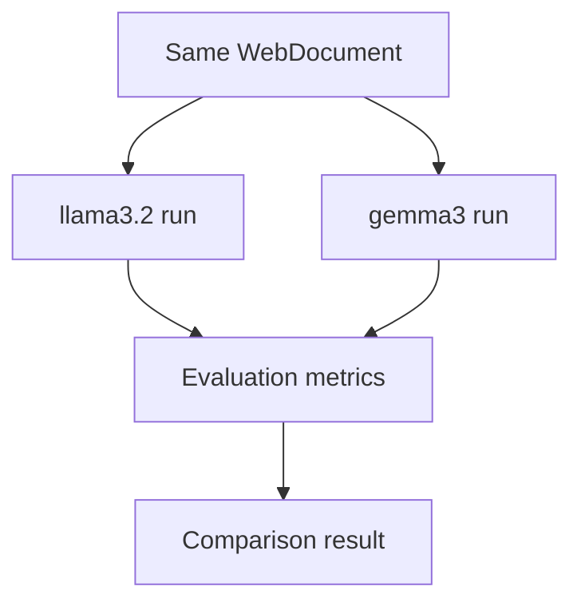

# LocalAI Research Assistant

A local-first AI research platform that ingests webpages, performs grounded research tasks with Ollama models, compares model performance, and exposes the system through CLI, FastAPI, and Gradio interfaces.

LocalAI Research Assistant is an AI engineering portfolio project built around practical local model workflows: source ingestion, structured prompting, Pydantic validation, model comparison, observability, and a browser-based demo UI.

## Demo

Recommended recruiter demo:

1. Start Ollama and make sure `llama3.2` is available.
2. Start the FastAPI backend.
3. Start the Gradio UI.
4. Open `http://127.0.0.1:7860`.
5. Enter `https://edwarddonner.com`.
6. Choose `Summary` and model `llama3.2`.
7. Run a model comparison with `llama3.2` and `gemma3`.
8. Open `System / Observability` to inspect request counts, model latency, and task metrics.

Screenshots are not committed yet because the browser automation surface was unavailable during final polish. Add manual screenshots later under `docs/images/` for:

- main Gradio research interface
- summary/result view
- model comparison view
- observability metrics view
- FastAPI Swagger docs

## Features

- Local Ollama integration through an OpenAI-compatible client
- Provider abstraction for model-independent research logic
- `llama3.2` and `gemma3` support
- Static webpage scraping with BeautifulSoup
- Playwright fallback for JavaScript-rendered pages
- Normalized `WebDocument` source model
- Structured summaries, topics, key facts, grounded Q&A, and research reports
- JSON-first model outputs with Pydantic validation
- Source-grounding prompts that instruct models not to invent facts
- Context truncation for long pages
- Multi-model comparison on the same ingested document
- Deterministic evaluation checks for parsing, grounding, completeness, and latency
- CLI, FastAPI, and Gradio interfaces
- Health/readiness endpoints
- Request IDs, structured logging, local metrics, and benchmark runner
- pytest and Ruff coverage for normal local/CI workflows

## Architecture



## How It Works



Model comparison uses the same ingested source for every model:



Observability is cross-cutting and intentionally local: request IDs, timing, logs, counters, and benchmark metrics are captured without an external telemetry platform.

## Technology Stack

| Area | Tools |
| --- | --- |
| Language/runtime | Python 3.12+, uv |
| Local models | Ollama, `llama3.2`, `gemma3` |
| LLM client | OpenAI Python client against Ollama's OpenAI-compatible endpoint |
| API | FastAPI, Uvicorn |
| UI | Gradio |
| Web ingestion | requests, BeautifulSoup4, Playwright |
| Data modeling | Pydantic, pydantic-settings |
| Testing/linting | pytest, Ruff |
| Observability | Python logging, request IDs, in-process metrics |

## Quick Start

Prerequisites:

- Python 3.12+
- `uv`
- Ollama running locally
- `llama3.2` pulled in Ollama
- `gemma3` pulled if you want model comparison

Install dependencies:

```powershell
uv sync
```

Install Chromium for Playwright fallback:

```powershell
uv run playwright install chromium
```

Pull local models:

```powershell
ollama pull llama3.2
ollama pull gemma3
```

Start the backend:

```powershell
uv run uvicorn app.api.app:app --host 127.0.0.1 --port 8000
```

Start the UI in a second terminal:

```powershell
uv run python -m ui.app
```

Open:

```text
http://127.0.0.1:7860
```

## Configuration

Configuration is loaded from environment variables or an optional local `.env`. No OpenAI API key is required.

```text
OLLAMA_BASE_URL=http://localhost:11434/v1
DEFAULT_MODEL=llama3.2
HTTP_TIMEOUT=15
BROWSER_TIMEOUT=20000
MIN_CONTENT_LENGTH=200
MAX_CONTEXT_CHARS=12000
API_HOST=127.0.0.1
API_PORT=8000
CORS_ORIGINS=http://localhost:7860,http://127.0.0.1:7860
API_BASE_URL=http://127.0.0.1:8000
GRADIO_HOST=127.0.0.1
GRADIO_PORT=7860
LOG_LEVEL=INFO
LOG_FORMAT=json
LOG_FILE=
```

Copy `.env.example` only if you need local overrides:

```powershell
Copy-Item .env.example .env
```

Do not commit `.env`.

## Using The UI

The Gradio app supports:

- Summary
- Facts
- Topics
- Ask
- Report
- Model comparison
- System / Observability

The UI calls the FastAPI backend over HTTP at `API_BASE_URL`. It does not call the research services directly.

## Using The API

Swagger UI:

```text
http://127.0.0.1:8000/docs
```

OpenAPI schema:

```text
http://127.0.0.1:8000/openapi.json
```

Endpoints:

| Method | Path | Purpose |
| --- | --- | --- |
| `GET` | `/health` | API health check |
| `GET` | `/health/ollama` | Ollama readiness check |
| `GET` | `/metrics` | Local observability metrics |
| `POST` | `/research/generate` | Direct local model generation |
| `POST` | `/research/summary` | Summarize a webpage |
| `POST` | `/research/facts` | Extract grounded key facts |
| `POST` | `/research/topics` | Extract topics |
| `POST` | `/research/report` | Generate a research report |
| `POST` | `/research/ask` | Ask a grounded source question |
| `POST` | `/compare` | Compare models on one task |

PowerShell examples:

```powershell
Invoke-RestMethod -Method Get -Uri http://127.0.0.1:8000/health

Invoke-RestMethod `
  -Method Post `
  -Uri http://127.0.0.1:8000/research/summary `
  -ContentType "application/json" `
  -Body '{"url":"https://edwarddonner.com","model":"llama3.2"}'

Invoke-RestMethod `
  -Method Post `
  -Uri http://127.0.0.1:8000/research/ask `
  -ContentType "application/json" `
  -Body '{"url":"https://edwarddonner.com","question":"What does this person do?","model":"gemma3"}'
```

Error responses use a consistent shape:

```json
{
  "error": {
    "code": "OLLAMA_UNAVAILABLE",
    "message": "The local Ollama service is unavailable."
  }
}
```

API responses include `X-Request-ID`.

## Using The CLI

Default local model prompt:

```powershell
uv run python -m app.main
```

Research tasks:

```powershell
uv run python -m app.main --url https://edwarddonner.com --task summary
uv run python -m app.main --url https://edwarddonner.com --task facts --model gemma3
uv run python -m app.main --url https://edwarddonner.com --task ask --question "What does this person do?"
uv run python -m app.main --url https://edwarddonner.com --task report
```

Model comparison:

```powershell
uv run python -m app.main --url https://edwarddonner.com --task summary --compare llama3.2 gemma3
```

## Model Comparison

The comparator runs the same research task against multiple local models using the same `WebDocument`. It records:

- model success/failure
- model latency
- response length
- JSON/Pydantic parse validity
- required field completeness
- grounding checks
- task-specific metrics such as fact count

It does not automatically declare a best model. Speed, parse reliability, completeness, and grounding are separate signals.

## Observability

Phase 7 added local observability:

- request IDs
- total request timing
- ingestion timing
- model latency
- task outcome
- selected model
- scraper used
- parsing success/failure
- evaluation metrics
- error categories
- usage counters

Metrics endpoint:

```powershell
Invoke-RestMethod -Method Get -Uri http://127.0.0.1:8000/metrics
```

Example metrics shape:

```json
{
  "requests": {
    "total": 25,
    "successful": 23,
    "failed": 2,
    "average_latency_ms": 1520.4
  },
  "models": {
    "llama3.2": {
      "requests": 15,
      "average_latency_ms": 18000
    }
  },
  "tasks": {
    "summary": 8,
    "facts": 5,
    "ask": 7
  },
  "ingestion": {
    "static": 22,
    "browser": 3
  },
  "errors": {},
  "parsing_failures": 0,
  "comparison_runs": 4,
  "unknown_answer_responses": 2
}
```

The metrics store is in-process and resets when the API process restarts.

## Benchmarking

Run the sample benchmark:

```powershell
uv run python -m app.evaluation.benchmark --config benchmarks/sample.json
```

JSON output:

```powershell
uv run python -m app.evaluation.benchmark --config benchmarks/sample.json --output json
```

The benchmark runner reports success rate, parse rate, grounding rate, and average latency by model. Results are hardware-specific and should be treated as local diagnostic signals, not scientific benchmarks.

## Testing

Run the normal test suite:

```powershell
uv run pytest
uv run ruff check .
```

Normal tests use mocks and do not require live websites, Ollama, Playwright browsers, local models, FastAPI running, or Gradio running.

CI runs the same local checks on push and pull request using Python 3.12 and `uv`.

## Engineering Decisions

- Static-first scraping: requests and BeautifulSoup are faster and lighter than browser rendering; Playwright is used only when extracted content is insufficient.
- Provider abstraction: research logic depends on `LLMProvider`, not directly on Ollama client code.
- Structured outputs: JSON plus Pydantic validation prevents silently accepting malformed model responses.
- Source grounding: prompts instruct the model to use only provided webpage content and say when information is missing.
- Local-first architecture: model execution stays on the developer machine and no cloud API key is required.
- Synchronous FastAPI routes: underlying scraping and model calls are blocking, so the API avoids fake async abstractions in this phase.
- In-process observability: local request IDs, metrics, and logs are appropriate for a portfolio demo but are not distributed telemetry.
- Deterministic evaluation: checks are transparent and testable but are not equivalent to human review or an LLM-as-judge framework.

## Limitations

- Local inference speed depends heavily on hardware and selected model.
- Webpages with authentication, paywalls, or anti-bot protections may fail.
- JavaScript-heavy applications may still require site-specific extraction logic.
- Long pages are truncated; this project does not include RAG, embeddings, or vector search.
- Metrics are in-process and not persisted.
- Benchmark results are hardware-specific.
- Deterministic quality checks can catch obvious failures but cannot prove factual correctness.
- This project is a local portfolio demo, not a hardened multi-user production service.

## Repository Structure

```text
app/
  api/                   # FastAPI app, routes, middleware, error handling
  core/                  # Pydantic settings
  evaluation/            # Model comparison, deterministic metrics, benchmarks
  ingestion/             # Static scraper, browser scraper, fallback ingestor
  llm/                   # Provider interface and Ollama implementation
  observability/         # Logging, request IDs, timers, metrics store
  research/              # Prompt builders, parsers, research engine, models
  services/              # Application orchestration
ui/                      # Gradio UI and HTTP API client
tests/                   # Unit and API tests with mocks
benchmarks/              # Small benchmark configs
docs/                    # Portfolio notes
```

## Project Roadmap

1. Core local LLM layer [done]
2. Website ingestion [done]
3. Research engine [done]
4. Model comparison & evaluation [done]
5. FastAPI backend [done]
6. Gradio UI [done]
7. Observability & benchmarking [done]
8. Portfolio polish [done]

## Future Work

- Persistent metrics and request history
- Background jobs for long-running research tasks
- Deeper evaluation harness with curated expected outputs
- Optional retrieval layer for very long documents
- Deployment guide for controlled local or private-network demos

## License

MIT License. See [LICENSE](LICENSE).
